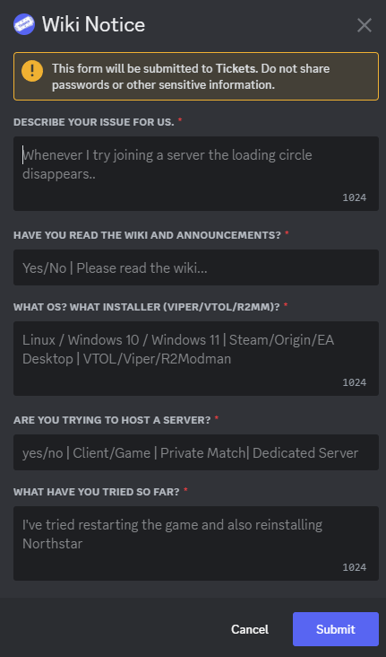
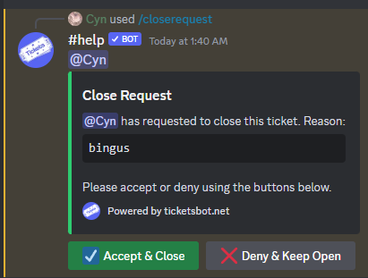
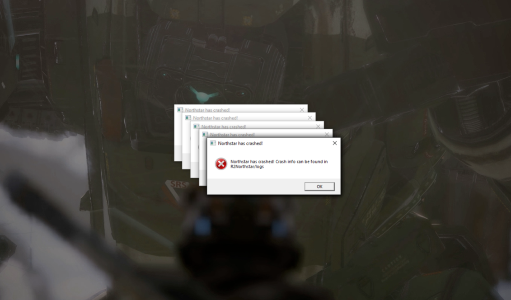
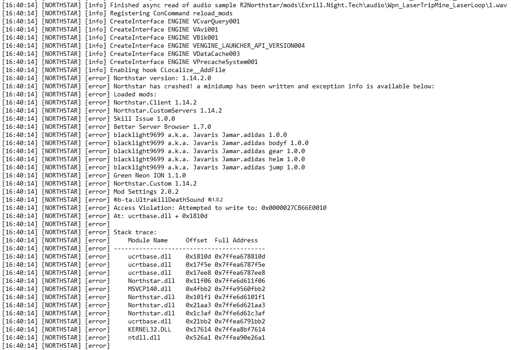

# Contributing

In case you feel like something is out of place, not accurate, biased, or if you just want to contribute, please [open a new issue](https://github.com/R2Northstar/NorthstarWiki/issues/) or [make a pull request](https://github.com/R2Northstar/NorthstarWiki/pulls) to our wiki:\
[https://github.com/R2Northstar/NorthstarWiki](https://github.com/R2Northstar/NorthstarWiki)

# Helping

This section is meant mostly for those that will be actively helping others in the Northstar Discord server or otherwise. If you've somehow stumbled upon this page trying to fix an issue for yourself, you should try checking the [troubleshooting page](docs/installing-northstar/troubleshooting.md). If you're a helper, it also isn't a bad idea to look at this page a few times and try to have a rough idea of the things that are on it.

As of {ENTER DATE HERE WHEN SPECTRE GETS ADDED}, Cyn(cooldudepugs)'s Discord bot [Spectre](https://github.com/CooldudePUGS/Spectre) was added to Northstar's Discord. This bot tries to automatically redirect users to opening a ticket in the `#help` channel, and automatically replies to some messages regarding issues with the game, however it cannot and will not catch all cases, even of basic help. When helping a user, please try to move them to the `#help` channel as well to keep public channels less cluttered. If they really don't want to open a ticket or you don't want to deal with a ticket, ask them to move to `#northstar-chat`. There, not only can they embed things, but it'll be slightly more focused on helping than general would be.

Arguably the most important things to know as a helper are the ability to read logs and deal with users that don't read the wiki (90% of tickets are solutions solvable by checking the wiki. There is a pretty high chance that even if the user says yes, they read the wiki, that they didn't or didn't find their issue on there)

Reading logs is a little tougher however, but once you get the basics down you can easily diagnose issues in a few seconds after opening a log. You can use `/tag id:logs` to inform users how to properly send a log in a Discord channel. Generally, when reading a log there are a list of things you want to look for, which will be covered later.

The first section will first go over extremely common issues and their tags, then the basics of using the help bot for commands inside tickets, and then some overview and specific examples for reading logs.

## Common issues and their tags

In the Northstar Discord server, a massively used device to help end users is the tickets bot. A lot of the common issues and questions that come up have tags for them on the Discord server. The tag command for the tickets bot is `/tag`, and you can either type `/tag id:{TAG ID HERE}` or let the bot autofill the tag for you after typing `/tag` and selecting the tag id from the list(make sure you select the ticket bot, and not Dyno!). Note, you can't reply to a user while using a slash command, so try to reply to the bot's message after sending the tag command while pinging the person it's directed at and informing them that they should follow the provided solution.

Here, this guide will go over common issues and their tag id's, trying to have the more commonly used tags near the top.

"Couldn't find player account/Invalid Masterserver Token (when the Mastserver isn't down)": `/tag id:playernotfound` (It's named this as the error used to simply say `Player Not Found`. The linked wiki section contains all known fixes. Spectre should catch _most_ of these questions)

"Failed creating log file!/Mod manager not installing mods properly": `/tag id:ea-app` (It's named this way as this is almost always the fault of EA App's default install path not being writable. Note that antivirus programs APART from Windows Defender can also cause mod managers to not properly install Northstar/mods)

"My controller isn't working": `/tag id:controller` (This links to the specific section on adding launch options/Northstar's `.exe` file to Steam to use it's controller support, as well as mentioning DS4Windows as a backup in the case of a PS4/DS4 (**D**ual**S**hock**4**) controller)

"How do I play with friends?": `/tag id:host-listen` (This goes over hosting a listen server, which is what hitting `Private Match` in Northstar does. Try to inform the user that they can't invite friends normally and have to do this in order to make a private match. If they ask about port forwarding, ask them to Google how to do it for their specific router as it tends to differ, sometimes heavily, from router to router)

"How to play co-op?": `/tag id:coop` (This gives a detailed mini explanation on how to install the co-op mod, and host a server to run it. Try to inform the user that it's still heavily WIP and has some issues. Listen servers don't allow for joining mid game; to do this, they must host a dedicated server with the "coop patches" mod provided with this tag)

"How to play Frontier Defnse?": `/tag id:fd` (This is called `fd` as it's the abbreviation for **F**rontier **D**efense. This tag goes over how to install and set up Frontier Defense, like co-op's tag. Try to inform the user that it's still heavily WIP)

"How do I use X mod manager?": The 3 "main" mod managers all have guides. `/tag id:{INSTALLER NAME HERE}-guide` links to the specified installer's guide

"How do I (manually) install Northstar?": `/tag id:manual-install` (This goes over installing, extracting, and replacing the files as well as giving a video guide. Spectre should catch _most_ of these questions)

"How do I (manually) install mods?": `/tag id:install-mods` (Try to inform the user that they should also make sure to check for mod dependencies when manually installing mods. Spectre should catch _most_ of these questions)

"How do I verify files?": `/tag id:verify-files` (This links to a section detailing verifying for all 3 platforms)

These are most of the most common and most used tags for helping people. More exist, however these are the "main" ones helpers should know

## Ticket channel commands

This entire section only applies to users with ticket-staff+ roles who can see the ticket channels in the Discord server

The tickets have a fairly straightforward way of operating. When a user clicks on a button to open a ticket (a staff ticket is only visible by helper+ roles, while a public ticket is visible by ticket-staff+ roles) they're greeted with the following screen:\

They will fill this out with information which will later be shared in their ticket as a message sent as an embed by the ticket bot. This will be the first message in the channel and will look something similar to this:\

Note the buttons below the embed.\
Hitting `Close` will close the ticket without a reason for closing it.\
`Close with reason` will let you give a reason as to why you closed the ticket.\
`Claim` allows you to "claim" a ticket and lets other helpers know that you'll be solving the ticket. This doesn't usually get used for Northstar, however people can still message in the channel even after it's claimed so don't worry if you accidentally claim a ticket/end up not being able to solve it.

These buttons, however, are not always easy to scroll back up to, especially if the ticket has been open for a while. This is where slash commands come in.

There are 3 major slash commands for tickets. These are `/close`, `/closerequest`, and `/add`.

`/close` by itself will close the ticket immediately, without a reason. Using a slash command however, you can give a reason for closing using the `reason` option for the slash command. 

`/add` will add a normal (non ticket-viewing) user to a ticket. This is useful if, for example, someone who created a mod and can't see the tickets has one of their mods create an error for a user and you can't diagnose it. This is also useful for cases where someone opens a ticket for someone else.

You may have noticed that `/closerequest` has been skipped. That's because there's sort of a "etiquette" surrounding it.

Generally, you _should_ use `/closerequest` for closing a ticket. There's much less chance the end user gets upset, and it can be denied last minute if another issue comes up. `/closerequest` sends an embed to the user that looks like the following:\

From here, the user can accept the close request, which in turn closes the ticket, or deny the close request, while results in an edited embed telling you they denied it.

To _use_ the `/closerequest` command, there are a few "ways" to use it.\
Note that `close_delay` is a number, meaning the time in hours before the ticket autocloses.\
`reason` is a box to input the reason for a close request.\
Using "ac" as described later lets other people know how long until the ticket will close. "ac" meaning **A**uto **C**lose.

If the ticket very highly seems resolved/the user has said they have no issues, use `/closerequest` with `close_delay` set to `1` and the `reason` set to "resolved, ac 1hr"\
If the ticket seems like it _might_ be resolved, try a `close_delay` of `3-8` (use your judgement) with the `reason` "seemingly resolved, ac {HOUR-COUNT}hr". This gives the user more time to deny the request if the issue isn't actually resolved\
For inactive tickets (when it's the _user_ not responding) we usually give them a few days (3-5, sometimes longer if we forget) then start pinging them once a day. If they continue to not respond for 2-3 days, we tend to set a close request with `close_delay` set to `24` or `48` (`24` is especially nicer for users who _never_ responded to their ticket), and the `reason` set to "no response, ac {HOUR-COUNT}hr" or "inactive ticket, ac {hour count}hr"

You can also use `/closerequest` without giving a `close_delay` or a `reason`, however you should always try to give a reason for closing a ticket, and if you don't give a `close_delay` there's a high chance that the ticket doesn't get closed (quite a few end users don't accept or see the close request)

You can view information on the closed tickets, such as open and close date, who opened the ticket, who closed the ticket, and the reason for closing the ticket in the `#transcripts` channel. The bot also provides an online log of the entire ticket connected to the embed when a ticket is closed.

### General log reading
1. Looking for the error
   
    When reading a log, the errors are generally easy to find. You can usually scroll to the bottom of the log, then look for an error message for script compilation errors, or a crash dump. Note that the crash dump isn't usually all to helpful in itself, however for both crash dumps and script compilations, generally you can look at the areas surrounding it to see what mod is loaded before the error and start from there. Read the specifics for more in depth explanations of each.
   
2. Time and date
 
   If a log doesn't display the time, date, or version of Northstar, tell the user to update their Northstar. If none of these exist, the Northstar install is ancient :)

### Specifics of log reading
1. Script compilation error

     This error generally arises due to a mod installed breaking, not having a valid dependency, or conflicting with another installed mod (sometimes, even core mods!). For these issues, there are two ways you can go about them. If they're issues with mod dependencies, the log will state something like the following:

   (Note: These log examples ARE out of date. The error messages, however, have stayed the same or relatively similar)
   
   This is a specific example of the user not having [ClientKillCallback](https://northstar.thunderstore.io/package/S2Mods/ClientKillCallback/) installed.\
   

   For these, have the user install the respective missing dependency if you can tell what it is.

   If installing a mod's dependency doesn't make it work, you can always have the user remove the mod. You can piece together what mod it is by looking at the file name that causes the error (for example, the screenshot earlier says `s2_wg_overhaul.nut` which means **W**ar**G**ames Overhaul). The file names will not always line up with the exact mod name, and some are named different things entirely. For cases like these, you can try to check the last loaded folder before the error occurs, such as the following:
   
      Here, we see that a folder named `s2.WarGamesOverhaul` is the last loaded folder before a file is causing issues. This usually makes it quite easy to debug what it is. You should also try to search for these on [Thunderstore](https://northstar.thunderstore.io/package/) to see if you can find any abbreviations/shortened names for mods, and what the mod's actual name is. 9 times out of 10, this method will work, however this isn't always the case.\
   

   Sometimes, the issue isn't a dependency and instead says something completely random. Here we can see that [Mastiff Reactive Skin](https://northstar.thunderstore.io/package/S2Mods/MastiffKillReactiveSkin/) causes a weird error not described so far in the guide. For these, the user should first try to update the mod that's causing the issue. If that doesn't work, follow the part about enabling mods to see what causes the issue if this doesn't fix it, or have the user remove/disable the mod.\
   

   Note that a decent amount of the time, even after solving one of these, more can arise that previously didn't! This doesn't mean that the last thing you/the user tried caused more errors, but it's important to note that more can come up after solving one. This happens because, for example, `X` and `Y` mod both have compile errors, but `X` mod loads before `Y` mod. Therefore, `X` mod shows a complie error while `Y` doesn't, even though `Y` also isn't working. Then, once `X` mod is fixed in one way or another, `Y` mod is allowed to load, only for the "new" error to be shown.

   Both the "random errors" and "new" errors arising after solving old ones are _especially_ prevalent with people who manually install that don't update their mods, then try to install new mods that use newer dependency versions.

2. Crash dumps

     Crash dumps are snippets of information given in logs when Northstar "hard crashes". These dumps aren't generally all too useful for giving you an exact error, however they can still hold vital information. Crash dumps tend to look like this:
   
   This part importantly gives a list of loaded mods and their versions.\
   
   
   This part is normally much easier to spot (in my opinion, at least) and more recognizable for quickly looking at a log.\
   

   When seeing a crash dump, many things can cause it. Once again, this is almost always due to one or more installed mods. A lot of the times, however, these are harder to diagnose than a simple compile error. Generally, if the user disables all but core mods their game works (if not, they should manually delete their core mods and reinstall Northstar, either via a mod manager or manually. Be prepared to explain every step of manually reinstalling if you ask them to do so), and it's then recommended that they enable dependency mods first (e.g. `ClientKillCallback` as shown previously. They should be enabled first so that mods using them don't cause compile errors due to missing their dependencies), then enable mods in batches of anywhere from 2-4 (this depends on how many mods they have, try to use your judgement and recommend a number). This is a safe way to debug just about any error with Northstar as well.
   
3. Multiple crash dumps in one log/Multiple crash messages when launching Northstar

   This is almost always due to the user having multiple mods that replace the same part of the game installed. This is especially prevalent with sound mods such as [Goofy Ahh Soundpack](https://northstar.thunderstore.io/package/theNon/Goofy_Ahh_Soundpack/) where a _ton_ of sounds get replaced, however it's never stated which ones are. When debugging this, simply ask the user if they have multiple sound mods that replace the same sound installed. If they say yes, tell them to remove/disable the mods that replace the same sounds. If they say no, ask if they have the before mentioned `Goofy Ahh Soundpack` mod installed (yes, it is that common of a cause for this issue). If they do, tell them to disable ALL other sound mods when using it. 

   A few more decently common causes for this are EXRILL's [Scorch fire Color pack](https://northstar.thunderstore.io/package/EXRILL/Exrills_Scorch_fire_Color_pack/), [Plasma weapons Color pack](https://northstar.thunderstore.io/package/EXRILL/Exrills_color_Plasma_pack/), and [Charge rifle Color pack](https://northstar.thunderstore.io/package/EXRILL/Exrills_Charge_Rifle_Color_Pack/) where they installs various seperate mods that all replace the same thing, with the idea that you only use one at a time. More often than not, it's sound mods conflicting, but if the user doesn't have any/already disabled some, check for these or other mods like them.

   An example of multiple crash messages when launching Northstar:\
   

   Multiple crash dumps in one log are either very easy to find, or very easy to skip over. It's especially given away when this is the cause because the log tends to show a crash dump, then continues to load for a while longer (if it's one crash dump near the end of the file and it only continues to load for a couple lines, that's usually negligible and you should probably focus on normal crash dumps instead)

   Examples of multiple crash dumps in a Northstar log:\
   A crash dump in the middle of loading:\
   

   A _second_ crash dump practically _inside_ of the previous crash dump:\
   

   A crash dump during loading by itself isn't too likely to be this issue, but in the middle of continued loading, it tends to be.\
   Sometimes these can get so bad that every other line is a new crash dump!

## Contacting us

You are welcome to create an issue at:\
[https://github.com/R2Northstar/NorthstarWiki/issues](https://github.com/R2Northstar/NorthstarWiki/issues)

Alternatively feel free to reach out via Discord:\
[https://northstar.tf/discord](https://northstar.tf/discord)
